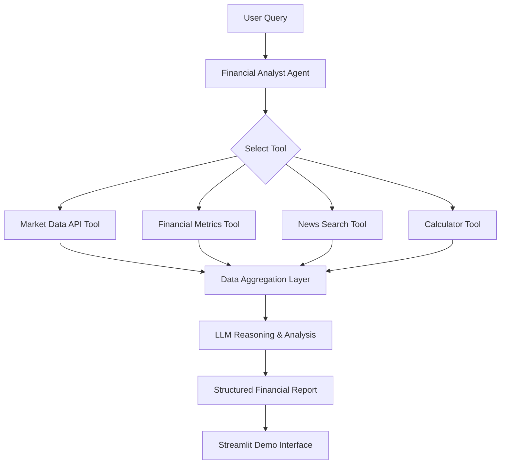

# 📊 AgenticAI Financial Analyst - Tools Using

An **Agentic AI application** that analyzes stocks or cryptocurrencies using real-time financial data and market news.  
The system uses an **LLM-powered tool-using agent** that autonomously selects the appropriate tools to gather information and generate a structured financial analysis report.

This project demonstrates **Agentic AI architecture** using **OpenAI, LangChain/LangGraph, and Streamlit**.

---

## Overview
This project implements an **Agentic AI workflow** where the model can:

- understand financial analysis requests
- decide which tools to use
- retrieve real-time data
- combine multiple information sources
- generate an analyst-style report

Example user prompt:"Analyze Tesla stock and summarize opportunities and risks."

Example output:
#### Asset: Tesla (TSLA)

- Current Price: $243.10

- Key Metrics
	•	Market Cap: $773B
	•	P/E Ratio: 67
	•	Revenue Growth: 24%

- Recent News
	•	Tesla expands gigafactory production
	•	Analysts expect strong EV demand

- Opportunities
	•	Growth in EV market
	•	Expansion into AI and robotics

- Risks
	•	Competition from Chinese EV manufacturers
	•	Regulatory pressure"

---

## Agent Architecture

The system is designed as a **tool-using AI agent** capable of dynamic decision-making.


---
## Agent Tools

The agent can autonomously call tools during reasoning.

**Market Data Tool**

- Fetches current financial data.

- Possible APIs:
	•	Yahoo Finance
	•	AlphaVantage
	•	CoinGecko

- Data returned:
	•	asset price
	•	market cap
	•	trading volume
	•	historical data

**Financial Metrics Tool**

- Extracts financial indicators such as:
	•	P/E ratio
	•	revenue growth
	•	earnings
	•	profit margins

**News Search Tool**

- Retrieves recent financial news using:
	•	SerpAPI
	•	News API

- Helps detect:
	•	macroeconomic trends
	•	company announcements
	•	analyst sentiment

**Calculator Tool**

- Performs numeric operations such as:
	•	percentage change
	•	growth rates
	•	financial ratio calculations

---
## Technology Stack
	•	Python
	•	OpenAI API
	•	LangChain
	•	LangGraph
	•	Pandas
	•	Yahoo Finance / AlphaVantage
	•	SerpAPI
	•	Streamlit
	•	Pydantic
---
## Installation

- Clone the repository:

```git clone https://github.com/yourusername/ai-financial-analyst-agent.git
cd ai-financial-analyst-agent```

- Install dependencies:
```pip install -r requirements.txt```
---
## Environment Variables

Create a .env file:
OPENAI_API_KEY=your_openai_key
TAVILY_API_KEY=your_tavily_key
---
## Running the Agent

Run the Streamlit demo interface:
```streamlit run ui/streamlit_app.py```
The app will open in your browser.

Example query: "Analyze Nvidia stock and summarize opportunities and risks."
---
## Streamlit Demo Interface

The Streamlit UI allows users to:
	•	enter an asset name or ticker
	•	run the AI financial analysis
	•	view structured analysis results
---
## Example Quieries
Analyze Tesla stock.
Analyze Nvidia stock and summarize risks.
Analyze Bitcoin price trends.
Compare Apple and Microsoft financial metrics.
---
## Use Case


